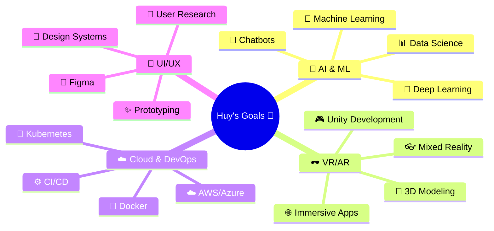

# 👋 Hi there, I'm Huy Nguyễn!

---

## 🚀 About Me

- 🎓 **Student Developer** passionate about building innovative solutions
- 📍 Based in **Ho Chi Minh City, Vietnam** 🇻🇳
- 🌱 Currently building my **full-stack .NET** skills across backend, web, desktop, and cloud
- 🧩 Hands-on experience with **backend APIs, databases, desktop apps, web, and cloud deployment**
- 🚀 Interested in **AI, VR/AR, 3D Modeling, and Cloud Computing**
- 💡 Love creating intuitive and user-friendly **UI/UX** experiences
- ✨ Motto: *"Building innovative solutions, one line of code at a time"*

---

## 🛠️ Technical Arsenal

### 💻 Languages:

  
  
  
  
  
  
  
  
  

### 🧩 Frameworks & Platforms:

  
  
  
  
  
  

### 🗄️ Databases:

  
  
  

### ☁️ Cloud / Deployment / Services:

  
  
  

### 🧪 Development Platforms:

  
  
  

### 🔧 Tools:

  
  
  
  
  
  
  

### 🌱 Currently Learning:

  
  
  
  

- 🚀 **Modern Full Stack .NET Development**
- ☁️ **Cloud Deployment**
- 🏗️ **Software Architecture**
- ⚡ **Database Optimization**

---

## 🎯 Featured Projects

<table>
  <tr>
    <td width="50%">
      <h3 align="center">🗺️ Smart Tourism QR Platform</h3>
      

        
      

      

        
        
        
        
      

      

        A tourism platform that uses QR codes to deliver location info and interactive experiences, built on a modern .NET web stack with a MySQL backend.
      

    </td>
    <td width="50%">
      <h3 align="center">📦 Office Supplies Management System</h3>
      

        
      

      

        
        
        
      

      

        A desktop management system for office supplies with full CRUD operations, built with C# WinForms and a SQL Server database.
      

    </td>
  </tr>
  <tr>
    <td width="50%">
      <h3 align="center">💾 Distributed Database Practice Collection</h3>
      

        
      

      

        
        
        
      

      

        A collection of hands-on exercises exploring distributed databases, SQL querying, and query optimization techniques.
      

    </td>
    <td width="50%">
      <h3 align="center">🧪 AntiGravity Experiments</h3>
      

        
      

      

        
        
        
      

      

        Experiments built with the AntiGravity IDE, exploring the .NET ecosystem and cross-platform development workflows.
      

    </td>
  </tr>
  <tr>
    <td width="50%">
      <h3 align="center">🚗 Car Business Website</h3>
      

        
      

      

        
        
        
      

      

        A comprehensive web application for car business management featuring a modern UI and robust functionality. Built with HTML/CSS, JavaScript, PHP and MySQL.
      

    </td>
    <td width="50%">
      <h3 align="center">🏪 Convenience Store Management</h3>
      

        
      

      

        
        
        
      

      

        A Java-based store management system implementing efficient database operations and an intuitive user interface, using JDBC to connect to a MySQL database.
      

    </td>
  </tr>
</table>

---

## 📊 Development Highlights

| Area | What I Work With |
| :--- | :--- |
| ⚙️ **Backend** | ASP.NET Core APIs, Entity Framework Core |
| 🌐 **Web** | Blazor, JavaScript / TypeScript, HTML5 / CSS3 |
| 🖥️ **Desktop** | WinForms, .NET MAUI cross-platform apps |
| 🗄️ **Databases** | SQL Server, MySQL, SQLite, query optimization |
| ☁️ **Cloud & Services** | Supabase, Vercel, ngrok, GitHub Codespaces |

---

## 🎯 Future Roadmap

### 🚀 My Development Journey

```mermaid
mindmap
  root((Huy's Goals 🎯))
    🤖 AI & ML
      💬 Chatbots
      🧠 Machine Learning
      🔬 Deep Learning
      📊 Data Science
    🕶️ VR/AR
      🎮 Unity Development
      🗿 3D Modeling
      🌐 Immersive Apps
      👓 Mixed Reality
    ☁️ Cloud & DevOps
      ☁️ AWS/Azure
      🐳 Docker
      ⚙️ CI/CD
      🔄 Kubernetes
    🎨 UI/UX
      🎨 Figma
      📐 Design Systems
      👥 User Research
      ✨ Prototyping
```

 

### 📋 Detailed Roadmap

<table color="white">
  <tr>
    <th>🤖 AI Development</th>
    <th>🕶️ VR/AR Apps</th>
    <th>🎮 Game Dev</th>
    <th>☁️ Cloud Computing</th>
    <th>🎨 UI/UX Design</th>
  </tr>
  <tr>
    <td align="center">
      💬 Chatbots 
      🧠 ML Models 
      🔬 Deep Learning 
      📊 Data Analysis
    </td>
    <td align="center">
      🌐 Immersive Apps 
      🎮 Unity 
      🗿 3D Modeling 
      👓 AR Experiences
    </td>
    <td align="center">
      🎮 Game Engines 
      🎨 Asset Creation 
      <!-- 🎵 Sound Design  -->
      🕹️ Gameplay
    </td>
    <td align="center">
      ☁️ AWS/Azure 
      🐳 Virtualization 
      ⚙️ Automation 
      🔐 Security
    </td>
    <td align="center">
      🎨 Figma 
      📐 Design Systems 
      👥 User Testing 
      ✨ Animation
    </td>
  </tr>
</table>

 

---

## 🌐 Let's Connect!

---

### 👀 Profile Views

---

---

**⭐️ From [DZT711](https://github.com/DZT711) with ❤️**

*"Code is like humor. When you have to explain it, it's bad." – Cory House*

