# 👋 Hi there, I'm Huy Nguyễn!

---

## 🚀 About Me

- 🎓 **Student Developer** passionate about building innovative solutions
- 📍 Based in **Ho Chi Minh City, Vietnam** 🇻🇳
- 🌱 Currently exploring **Web Development, Java, and Database Management**
- 🚀 Interested in **AI, VR/AR, 3D Modeling, and Cloud Computing**
- 💡 Love creating intuitive and user-friendly **UI/UX** experiences
- ✨ Motto: *"Building innovative solutions, one line of code at a time"*

---

## 🛠️ Technical Arsenal

### 💪 Experienced With:

  
  
  
  
  
  
  

### 🌱 Currently Learning:

  
  
  

### 🔧 Tools & Technologies:

  
  
  <!-- 
   -->

---

## 🎯 Featured Projects

<table>
  <tr>
    <td width="50%">
      <h3 align="center">🚗 Car Business Website</h3>
      

        
      

      

        A comprehensive web application for car business management featuring a modern UI and robust functionality. Built with Java, JSP, and MySQL.
      

    </td>
    <td width="50%">
      <h3 align="center">🏪 Convenience Store Management</h3>
      

        
      

      

        A Java-based store management system implementing efficient database operations and intuitive user interface.
      

    </td>
  </tr>
  <tr>
    <td width="50%">
      <h3 align="center">💾 Java Database Connectivity</h3>
      

        
      

      

        Showcasing practical implementations of JDBC with MySQL integration and best practices.
      

    </td>
    <td width="50%">
      <h3 align="center">✨ More Projects Coming Soon!</h3>
      

        
      

      

        Working on exciting new projects in AI, VR/AR, and web development. Stay tuned!
      

    </td>
  </tr>
</table>

---

## 📊 GitHub Statistics

  
  

  

  

---

## 🎯 Future Roadmap

### 🚀 My Development Journey

```mermaid
mindmap
  root((Huy's Goals 🎯))
    🤖 AI & ML
      💬 Chatbots
      🧠 Machine Learning
      🔬 Deep Learning
      📊 Data Science
    🕶️ VR/AR
      🎮 Unity Development
      🗿 3D Modeling
      🌐 Immersive Apps
      👓 Mixed Reality
    ☁️ Cloud & DevOps
      ☁️ AWS/Azure
      🐳 Docker
      ⚙️ CI/CD
      🔄 Kubernetes
    🎨 UI/UX
      🎨 Figma
      📐 Design Systems
      👥 User Research
      ✨ Prototyping
```

 

### 📋 Detailed Roadmap

<table color="white">
  <tr>
    <th>🤖 AI Development</th>
    <th>🕶️ VR/AR Apps</th>
    <th>🎮 Game Dev</th>
    <th>☁️ Cloud Computing</th>
    <th>🎨 UI/UX Design</th>
  </tr>
  <tr>
    <td align="center">
      💬 Chatbots 
      🧠 ML Models 
      🔬 Deep Learning 
      📊 Data Analysis
    </td>
    <td align="center">
      🌐 Immersive Apps 
      🮠Unity 
      🗿 3D Modeling 
      👓 AR Experiences
    </td>
    <td align="center">
      🮠Game Engines 
      🨠Asset Creation 
      🵠Sound Design 
      🕹️ Gameplay
    </td>
    <td align="center">
      ☁️ AWS/Azure 
      🳠Virtualization 
      ⚙️ Automation 
      🔐 Security
    </td>
    <td align="center">
      🎨 Figma 
      📐 Design Systems 
      👥 User Testing 
      ✨ Animation
    </td>
  </tr>
</table>

 

---

## 🌐 Let's Connect!

---

### 💭 Quote of the Day

### 👀 Profile Views

---

---

**⭐️ From [DZT711](https://github.com/DZT711) with ❤️**

*"Code is like humor. When you have to explain it, it's bad." – Cory House*

